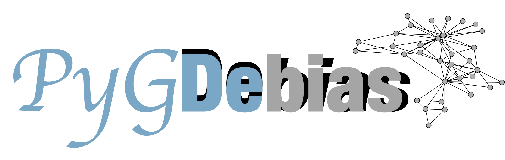

**I will be joining the [Department of Computer Science at Florida State University](https://www.cs.fsu.edu) as a tenure-track Assistant Professor in Fall 2024.**

**\[Recruiting PhDs & Interns\]:** I am actively seeking ambitious students for Ph.D. or research intern roles. Please [email me](mailto:yd6eb@virginia.edu) with your CV, transcripts, and brief descriptions of your preferred research topics. Kindly mark the subject with *[PhD/Research Intern Application]* to ensure attention.

I am a final-year Ph.D. candidate at the [University of Virginia](http://www.virginia.edu/) working with [Prof. Jundong Li](https://jundongli.github.io).

**(i) Research Summary:** My research interest mainly lies in achieving responsible AI to further advance social good such as facilitating inclusive decision-making. I have abundant research works under related topics with a particular focus on relational data, including **27 published research papers (nine first-author ones)** in the following areas [[see full list]](https://scholar.google.com/citations?hl=en&user=_QUhuOMAAAAJ):

* **Explainability:** Model Interpretability; Prediction Justification  
* **Algorithmic Fairness:** Fairness Measurement; Algorithm Debiasing  
* **Safety:** Attack and Defense
* **AI/ML+X (Applications):** Healthcare; Recommendation  

**(ii) Highlighted Honors:** I received [**Louis T. Rader Graduate Research Award**](https://www.linkedin.com/posts/jundong-li-09151b5b_uva-research-phd-activity-7057847052566683648-0NzM?utm_source=share&utm_medium=member_desktop), [**Endowed Fellowship**](https://engineering.virginia.edu/yushun-dong-earns-endowed-graduate-fellowship), and [**Best Poster @Doctoral Forum of SDM 2022**](https://www.siam.org/conferences/cm/conference/sdm22). I am truly grateful for the generous efforts from the associated institutions and organizers.

**(iii) Highlighted Project:** I initiated and have been managing the open-source tool [PyGDebias ](https://github.com/yushundong/PyGDebias) — a Python library featured for 20+ built-in datasets and 10+ implementations of popular fairness-aware graph learning algorithms. 

<!-- I have abundant interest in **Graph Mining**, e.g., **Spectral Graph Theory**, **Graph Neural Networks** and corresponding interdisciplinary topics. -->
<!-- My previous research experiences mainly lie in graph mining and feature fusion. -->

News
------
* Mar. 2024: One paper accepted by TheWebConf.
* Jan. 2024: One paper accepted by PAKDD.
* Jan. 2024: One paper accepted by ICLR.
* Nov. 2023: One paper accepted by TKDD.
* Nov. 2023: Passed dissertation proposal defense.
* Aug. 2023: One paper accepted by CIKM.
* May. 2023: One paper accepted by SIGKDD.
* Apr. 2023: One tutorial accepted by SIGKDD.
* May. 2023: One paper accepted by i3CE.
* Apr. 2023: One paper accepted by SIGIR.
* Apr. 2023: One paper accepted by TKDE.
* Mar. 2023: One paper accepted by ICHI.
* Dec. 2022: One paper accepted by SDM.
* Nov. 2022: One paper accepted by AAAI.  
...
<!-- * July 2022: An interesting and comprehensive survey paper "Federated Graph Machine Learning: A Survey of Concepts, Techniques, and Applications" released. [\[arXiv\]](https://arxiv.org/pdf/2207.11812.pdf) [\[Blog in Chinese\]](https://mp.weixin.qq.com/s/w0_DSd-hteYGfWnwKEALNQ) -->
<!-- * Apr. 2022: An interesting and comprehensive survey paper "Fairness in Graph Mining: A Survey" released. [\[arXiv\]](https://arxiv.org/abs/2204.09888) [\[Blog in Chinese\]](https://github.com/yushundong/Fairness-in-Graph-Mining-A-Survey) -->

<!-- * Oct. 2022: One paper accepted by WSDM. -->
<!-- * Sept. 2022: One paper accepted by SIGKDD Explorations. -->
<!-- * Sept. 2022: One paper accepted as spotlight by FedGraph 2022. -->
<!-- * Aug. 2022: One tutorial accepted by ICDM 2022 [\[Webpage\]](https://yushundong.github.io/ICDM_2022_tutorial.html). -->
<!-- * May. 2022: Three papers accepted by SIGKDD 2022. -->
<!-- * Apr. 2022: Best Poster (Runner-Up) @Doctoral Forum of SDM. Thanks for the efforts of organizers. -->
<!-- * Apr. 2022: One paper accepted by IJCAI 2022. -->
<!-- * Apr. 2022: One paper accepted by SIGIR 2022. -->
<!-- * Jan. 2022: Two papers accepted by WWW 2022. -->
<!-- * Jan. 2022: One paper accepted by PAKDD 2022. -->
<!-- * Aug. 2021: One paper accepted by CIKM 2021. -->
<!-- * May 2021: One paper accepted by SIGKDD 2021. -->

Industry Experiences
------
* June 2023 – Sept. 2023, Research Intern, Snap. Mentor: [Tong Zhao](https://tzhao.io), [Yozen Liu](https://scholar.google.com/citations?user=i3U2JjEAAAAJ&hl=en), and [Neil Shah](https://nshah.net).
* June 2022 – Sept. 2022, Research Intern, Microsoft Research. Mentor: [Tobias Schnabel](https://www.microsoft.com/en-us/research/people/toschnab/). 

Mentored Students (Partial List)
------
* [Pranav Bangarbale (Undergrad in CS @UVa)](https://www.linkedin.com/in/pranav-bangarbale-42091721b/)
* [Alex Jing Huang (Undergrad in CS @UVa)](https://www.linkedin.com/in/alex-huang-1171ab211/)
* [Srimanth Tangedipalli (Undergrad in CS @UVa)](https://www.linkedin.com/in/srimanth-tangedipalli/)
* [Mike Song (Quantitative researcher @J.P. Morgan)](https://weihaosong.github.io)
* [Eric, Xuanjia Bi (Undergrad in EE & CPE @UVa)](https://www.linkedin.com/in/xuanjia-bi/)
* [Deepaloke Chattopadhyay (M.S. @UVa, now Data Scientist @2nd Order Solutions)](https://www.linkedin.com/in/deepaloke-chattopadhyay/)
* [Zheng Huang (M.S. @UVa, now Software Development Engineer @Amazon)](https://www.linkedin.com/in/zheng-huang-39822a1a2/)
* [Yiling Yuan (Undergrad in CS @BUPT, now grad student @CMU)](https://www.linkedin.com/in/yilingyuan/?locale=en_US)
<!-- * * Edward Wei (Undergrad in CS @UVa) -->
<!-- * Kerui Huang (Undergrad in CS @UVa) -->
<!-- * Eric, Xuanjia Bi (Undergrad in EE & CPE @UVa) -->
<!-- * Srimanth Tangedipalli (Undergrad in CS @UVa) -->
<!-- * Mike Song (Quantitative researcher @J.P. Morgan) -->
<!-- * Deepaloke Chattopadhyay (M.S. @UVa, now Data Scientist @2nd Order Solutions) -->
<!-- * Chen Fan (M.S. @UMass) -->
<!-- * Srimanth Tangedipalli (B.S. in Computer Science @UVa) -->
<!-- * Nitin Maddi (B.S. in Computer Science @UVa) -->

Services
------
<!-- * **Invited Program Committee Co-Chairs**: SDM 2023. -->
* **Invited Program Committee Member**: AAAI 2024, CIKM 2023, ECMLPKDD 2023, KDD 2023, SDM 2023, CIKM 2022, SIGKDD 2022, AAAI 2022, WSDM 2022, etc.
* **Invited Reviewer & External Reviewer**:
SIGKDD, SIGIR, AAAI, ICML, WWW, ICLR, NeurIPS, TKDE, TKDD, CIKM, WSDM, ECML-PKDD, PAKDD, BigData, etc.
* **Volunteer**: SIGKDD 2021, IJCAI 2021, SIGKDD 2020, etc.

<!-- * CIKM 2021. -->
<!-- * **Reviewer & External Reviewer**: TKDE, TKDD, SIGKDD'21, SIGIR'21, ICML'21, PAKDD'21, WWW'21, ICLR'20, WSDM'21, BigData'20, SIGKDD'20, SIGIR'20, NeurIPS'20, WWW'20, ECML-PKDD'20, CIKM'20. -->

Invited Talks (Selected)
------
* Feb. 2024, "Artificial Intelligence: What Do We Have and Where We Are Heading?" at the University of Virginia. Host: [Prof. Xu Yi](https://engineering.virginia.edu/faculty/xu-yi).
* Feb. 2023, "Unlocking Ethical Graph Neural Networks" at the University of Texas Rio Grande Valley.  Host: [Prof. Yifeng Gao](https://www.utrgv.edu/csci/faculty/yifeng-gao/index.htm).
* Sept. 2022, "Fairness in Graph Mining: Metrics and Algorithms" at Mila - Quebec AI Institute [\[Slides\]](http://yushundong.github.io/files/Fairness_Invited_Talk.pdf).
<!-- * Sept. 2022, "Learning Causal Effects on Hypergraphs" at Microsoft Research.  -->

